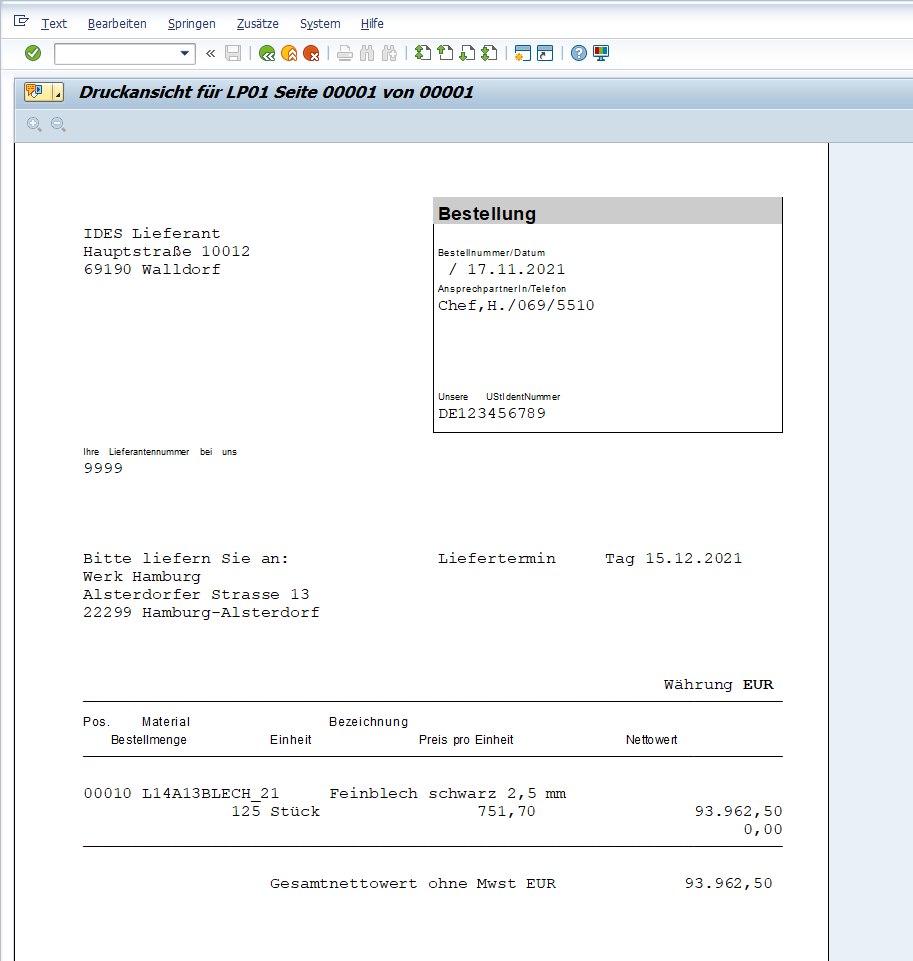

= SAP Notes

== Erste Stunde

nicht anwesend

== Zweite Stunde

=== Befehle

* mm01 - Material erstellen
* mm02 - Material ändern
* mm03 - Material anzeigen
* mmba - Bestandsübersicht
* ct04 - Merkmal anlegen - 3 mal machen
* cl02 - Klasse mit Merkmalen anlegen
* mm01 - Klasse Material zuordnen und befüllen  - KLassifizierung

== Info

Stammdaten (z.B Kostenstelle, Konto, Kostenart, Lieferdaten, Kundendaten etc.)

Stammdaten (engl.: master date) weden auch als feste Daten bezeichnet,
Sie werden einmal im System angelegt und stehen unverändert über einem längeren Zeitraum hinweg zur Verfügung stehen.
(Feste Daten)

Die Stammdaten stellen eine Art "Gerüst" dar.

== Dritte Stunde 17.11.2021

=== Materialwirtschaft | Beschaffung

BANF -> ANFRAGE -> ANGEBOT -> BESTELLUNG -> WARENEINGANG

*BANF Bestellanforderung*

Z.B. Ich frage nach ob ich einen Laptop bekomme. Ich frage aber nach keine speziellen Daten.

image:images/Bild3.jpg[]

image:images/Bild4.jpg[]

=== Was ist eine Submissionsnummer

Ordnungsnummer mit der man 2 Anfragen zusammenhaltet.

Eine Submissionsnummer kann aus bis zu zehn Ziffern oder Buchstaben bestehen und sie wird für Anfragen, die zusammengehören, verwendet.

Sie erleichtert das Ordnen der Anfrage und Angebote.

=== 2.2 Angebote einholen

```
Bestellanforderung unter Nummer 0010024248 hinzugefügt

Meldungsnr. 06402
```


==== 1. Angebotsfrist ändern

image::images/image-2021-11-17-15-39-31-440.png[]

==== 2. Submissionsnummer eingeben


==== 3. Ort 0001 | alles auswählen | Übernehmen + Detail

image::images/image-2021-11-17-15-41-21-529.png[]

==== 4. Überprüfen und Enter


==== 5. Speichern und Nummer kopieren unten

image::images/image-2021-11-17-15-43-22-555.png[]

==== Anfrage 1

```
Anfrage unter der Nummer 6000004330 angelegt

Meldungsnr. 06017

```

==== Anfrage 2

```
Anfrage unter der Nummer 6000004336 angelegt

Meldungsnr. 06017

```


*Lieferung = Fracht*

image::images/image-2021-11-17-16-05-50-289.png[]


*Doppelklick auf kein Preis | Merken Willhaben*

image::images/image-2021-11-17-16-08-45-366.png[]


image::images/image-2021-11-17-16-12-22-682.png[]


*Flag setzten und dann speichern:*


*ME57:*

image::images/image-2021-11-17-16-33-59-903.png[]

image::images/image-2021-11-17-16-34-48-626.png[]


image::images/image-2021-11-17-16-37-03-320.png[]

image::images/image-2021-11-17-16-38-27-897.png[]

image::images/image-2021-11-17-16-39-18-037.png[]



```
Normalbestellung unter der Nummer 4500019795 angelegt

Meldungsnr. 06017

```
